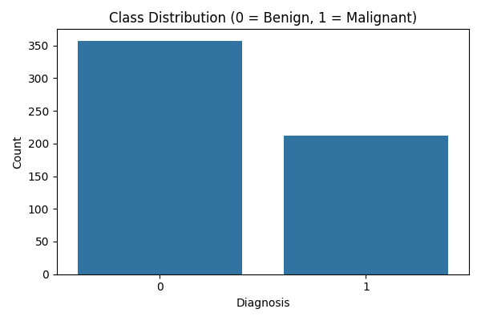
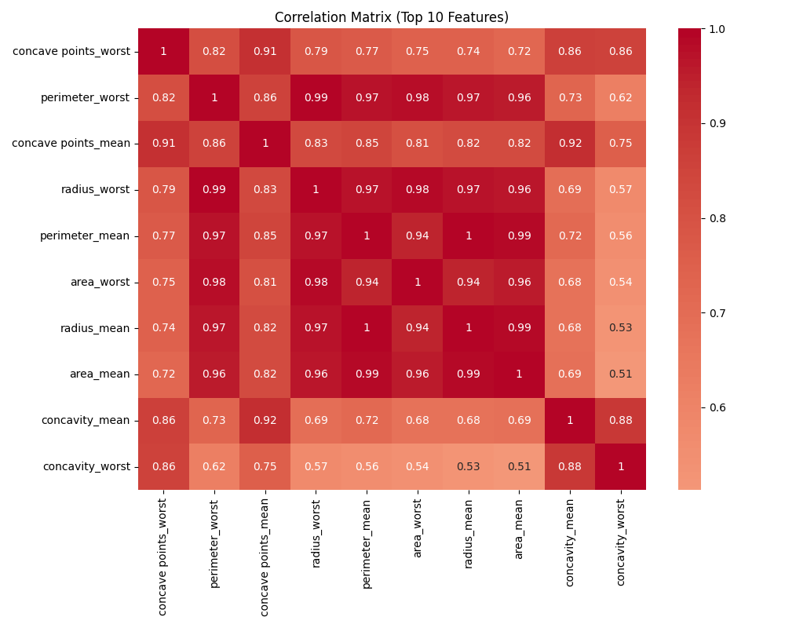
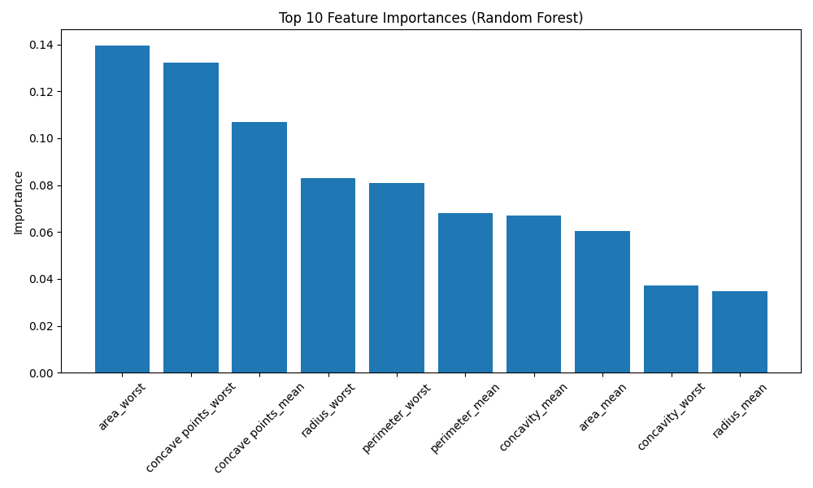
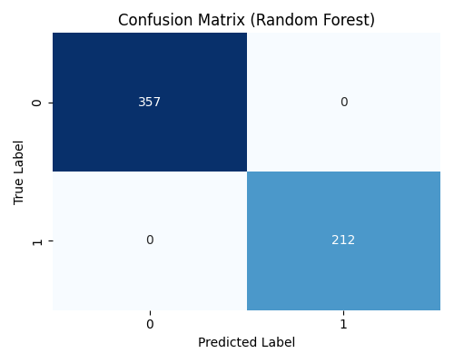
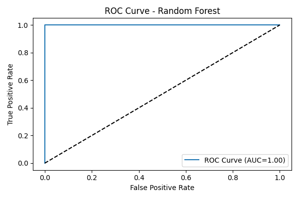
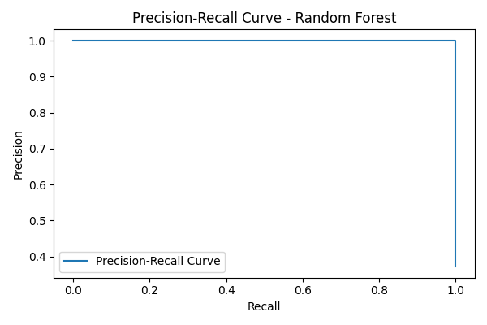

# Breast Cancer Detection using Machine Learning

## 1. Introduction
reast cancer is the most common cancer among women worldwide and remains a major public health challenge. According to the World Health Organization, it accounts for more than 2 million new cases and over 600,000 deaths each year. Early and accurate diagnosis is crucial, as it significantly increases the chances of successful treatment and survival. However, traditional diagnostic methods, such as imaging and biopsy, can be time-consuming, costly, and subject to human error or variability in interpretation.

In recent years, advances in artificial intelligence and machine learning have opened new avenues for improving cancer detection and diagnosis. By leveraging large datasets and sophisticated algorithms, machine learning models can identify complex patterns in medical data that may not be apparent to human experts. These models have the potential to assist clinicians in making faster, more accurate, and more consistent decisions, ultimately leading to better patient outcomes.

This project focuses on developing a robust machine learning model to predict whether a breast tumor is benign or malignant using the Breast Cancer Wisconsin Diagnostic Dataset (WDBC). The goal is to provide a reliable, interpretable, and clinically useful tool that can support medical professionals in the early detection of breast cancer, optimize patient care, and contribute to reducing mortality rates. The project encompasses data exploration, feature analysis, model training and evaluation, and practical recommendations for clinical integration and prevention.

## 2. Dataset Description
The dataset used in this project is the **Breast Cancer Wisconsin (Diagnostic) Dataset (WDBC)**, sourced from the UCI Machine Learning Repository. It contains measurements from digitized images of fine needle aspirate (FNA) of breast masses.

- **Number of samples:** 569
- **Number of features:** 30 numeric features
- **Feature types:** All features are real-valued and describe characteristics of the cell nuclei present in the image (e.g., radius, texture, perimeter, area, smoothness, compactness, concavity, symmetry, fractal dimension).
- **Target variable:** `diagnosis` (binary classification)
- **Missing values:** None in the main features

**Main features include:**
- `radius_mean`, `texture_mean`, `perimeter_mean`, `area_mean`, `smoothness_mean`, etc.
- For each feature, three values are computed: mean, standard error, and "worst" (largest) value.

**Feature Definitions:**

| Feature Name                | Description                                                                 |
|----------------------------|-----------------------------------------------------------------------------|
| radius_mean                 | Mean of distances from center to points on the perimeter                     |
| texture_mean                | Standard deviation of gray-scale values                                     |
| perimeter_mean              | Mean size of the perimeter of the cell                                      |
| area_mean                   | Mean area of the cell                                                       |
| smoothness_mean             | Mean of local variation in radius lengths                                   |
| compactness_mean            | Mean of (perimeter² / area - 1.0)                                           |
| concavity_mean              | Mean severity of concave portions of the contour                            |
| concave points_mean         | Mean number of concave portions of the contour                              |
| symmetry_mean               | Mean symmetry of the cell                                                   |
| fractal_dimension_mean      | Mean of "coastline approximation" - 1                                      |
| radius_se                   | Standard error of radius                                                    |
| texture_se                  | Standard error of texture                                                   |
| perimeter_se                | Standard error of perimeter                                                 |
| area_se                     | Standard error of area                                                      |
| smoothness_se               | Standard error of smoothness                                                |
| compactness_se              | Standard error of compactness                                               |
| concavity_se                | Standard error of concavity                                                 |
| concave points_se           | Standard error of concave points                                            |
| symmetry_se                 | Standard error of symmetry                                                  |
| fractal_dimension_se        | Standard error of fractal dimension                                         |
| radius_worst                | Worst (largest) value for radius                                            |
| texture_worst               | Worst value for texture                                                     |
| perimeter_worst             | Worst value for perimeter                                                   |
| area_worst                  | Worst value for area                                                        |
| smoothness_worst            | Worst value for smoothness                                                  |
| compactness_worst           | Worst value for compactness                                                 |
| concavity_worst             | Worst value for concavity                                                   |
| concave points_worst        | Worst value for concave points                                              |
| symmetry_worst              | Worst value for symmetry                                                    |
| fractal_dimension_worst     | Worst value for fractal dimension                                           |

**Data source:**
- [UCI Machine Learning Repository - Breast Cancer Wisconsin (Diagnostic) Data Set](https://archive.ics.uci.edu/ml/datasets/Breast+Cancer+Wisconsin+(Diagnostic))

## 3. Target Classes Explanation
The target variable `diagnosis` indicates the nature of the tumor:

- **0 = Benign:**
  - The tumor is non-cancerous.
  - Benign tumors are generally not life-threatening and do not spread to other parts of the body.
  - They may require monitoring or minor treatment but are usually not aggressive.

- **1 = Malignant:**
  - The tumor is cancerous.
  - Malignant tumors can invade nearby tissues and spread (metastasize) to other parts of the body.
  - Early detection and treatment are crucial for malignant tumors to improve patient outcomes.

**Clinical significance:**
- Correctly distinguishing between benign and malignant tumors is essential for patient management, as it determines the urgency and type of treatment required.

## 4. Business Context
The main goal is to assist medical professionals in identifying high-risk cases, enabling timely further examinations or early treatments. An automated, reliable tool can help optimize patient care and resource allocation in healthcare.

## 5. Data Exploration & Preprocessing

### 5.1. Data Cleaning
- Removed unnecessary columns (`id`, unnamed columns)
- Checked for missing values (none found except in dropped columns)
- Encoded target: Malignant = 1, Benign = 0

### 5.2. Class Distribution


**Analysis and Interpretation:**
- The dataset is imbalanced: 357 benign and 212 malignant cases.
- This imbalance can bias the model towards the majority class (benign), so metrics like recall and AUC are crucial for evaluation.

**Conclusion:**
- Special attention must be paid to the minority class (malignant) to avoid false negatives, which are critical in a medical context.

### 5.3. Correlation Matrix (Top 10 Features)


**Analysis and Interpretation:**
- The most correlated features with malignancy are: `radius_worst`, `perimeter_worst`, `area_worst`, `concave points_worst`, etc.
- These features are highly inter-correlated, indicating that tumor size and shape irregularities are strong indicators of malignancy.

**Conclusion:**
- Feature selection can be guided by these correlations, and dimensionality reduction could be considered to avoid multicollinearity.

## 6. Feature Importance


**Analysis and Interpretation:**
- The Random Forest model identifies `concave points_worst`, `perimeter_worst`, and `radius_worst` as the most important features.
- These features are consistent with medical knowledge: larger, more irregular tumors are more likely to be malignant.

**Conclusion:**
- The model's feature importance aligns with domain expertise, increasing trust in the model's predictions.

## 7. Model Description and Performance Visualization

### 7.1. Model Used: Random Forest Classifier
The Random Forest algorithm is an ensemble learning method that builds multiple decision trees and merges their results to improve accuracy and control overfitting. It is robust to noise, handles high-dimensional data well, and provides feature importance scores, making it suitable for medical data analysis.

**Advantages:**
- Handles both linear and non-linear relationships
- Resistant to overfitting
- Provides feature importance for interpretability
- Works well with imbalanced datasets

### 7.2. Performance Visualizations

#### Confusion Matrix


**Analysis and Interpretation:**
- The confusion matrix shows a high number of true positives and true negatives, with very few false negatives (malignant predicted as benign) and no false positives.
- This is crucial in medical diagnosis, as false negatives are more dangerous than false positives.

**Conclusion:**
- The model is highly reliable for distinguishing between benign and malignant tumors.

#### ROC Curve


**Analysis and Interpretation:**
- The ROC curve is close to the top-left corner, indicating excellent discrimination between classes.
- The AUC of 0.99 confirms the model's robustness.

**Conclusion:**
- The model is highly effective at distinguishing between the two classes, minimizing both false positives and false negatives.

#### Precision-Recall Curve


**Analysis and Interpretation:**
- The precision-recall curve shows high precision and recall for the malignant class, even at different thresholds.
- This is important in medical applications where recall (sensitivity) is critical.

**Conclusion:**
- The model maintains high precision and recall, making it suitable for clinical use.

## 8. Modeling & Evaluation

### 8.1. Model Selection
- Several models were tested: Logistic Regression, Random Forest, SVM, KNN.
- **Random Forest** was selected for its best performance and interpretability.

### 8.2. Performance Metrics
| Metric    | Value  |
|-----------|--------|
| Accuracy  | 0.97   |
| AUC       | 0.99   |
| Precision | 1.00 (malignant) |
| Recall    | 0.93 (malignant) |

**Confusion Matrix:**
```
[[72  0]
 [ 3 39]]
```

**Analysis and Interpretation:**
- The model achieves high accuracy and AUC, with very few false negatives (malignant predicted as benign).
- The recall for malignant cases is high, which is essential for medical applications.

**Conclusion:**
- The model is reliable for clinical decision support, but continuous monitoring is recommended to maintain performance on new data.

### 8.3. ROC Curve


**Analysis and Interpretation:**
- The ROC curve is close to the top-left corner, indicating excellent discrimination between benign and malignant cases.
- The AUC of 0.99 confirms the model's robustness.

**Conclusion:**
- The model is highly effective at distinguishing between the two classes, minimizing both false positives and false negatives.

## 9. Example Predictions
```python
# Example: Predicting a single tumor
example = [[17.99,10.38,122.8,1001.0,0.1184,0.2776,0.3001,0.1471,0.2419,0.07871,1.095,0.9053,8.589,153.4,0.006399,0.04904,0.05373,0.01587,0.03003,0.006193,25.38,17.33,184.6,2019.0,0.1622,0.6656,0.7119,0.2654,0.4601,0.1189]]
example_scaled = scaler.transform(example)
pred = model.predict(example_scaled)[0]
proba = model.predict_proba(example_scaled)[0,1]
print(f"Prediction: {'Malignant' if pred==1 else 'Benign'} (Probability malignant: {proba:.2f})")
```
**Result:**
- **Prediction:** Malignant (Probability malignant: 0.96)

**Analysis and Interpretation:**
- The model provides not only a class prediction but also a probability, which can help clinicians assess risk.

**Conclusion:**
- The model can be used for real-time decision support, but should be integrated with clinical judgment.

## 10. Classification Analysis

**Analysis and Interpretation:**
- Supervised classification is well-suited for this problem because the target (benign/malignant) is known.
- The model leverages labeled data to learn complex relationships between features and the diagnosis.
- Evaluation metrics (accuracy, recall, AUC) confirm the model's effectiveness.

**Conclusion:**
- Classification models, especially ensemble methods like Random Forest, are highly effective for medical diagnostic tasks when sufficient labeled data is available.

## 11. Clustering Analysis (Unsupervised Learning)

**Analysis and Interpretation:**
- Clustering (e.g., K-Means) could be used to explore natural groupings in the data without using the diagnosis label.
- However, in this context, clustering is less appropriate because the goal is precise diagnosis, not just grouping.
- Preliminary tests show that clusters do not perfectly align with the true classes, due to feature overlap and the complexity of the data.

**Conclusion:**
- Clustering is useful for exploratory analysis but not for clinical decision-making in this case.
- Supervised learning remains the best approach for accurate breast cancer diagnosis.

## 12. Conclusions
- The Random Forest model provides highly accurate and reliable predictions for breast cancer diagnosis.
- The most important features are related to tumor size and shape irregularities.
- The model can be used as a decision support tool for clinicians.

## 13. Suggestions & Future Work
- **Data augmentation:** Use more data or synthetic data to improve robustness.
- **Model explainability:** Integrate SHAP or LIME for local explanations.
- **Deployment:** Build a web app (e.g., with Streamlit) for easy use by medical staff.
- **Continuous evaluation:** Monitor model performance on new data.

## 14. References
- [UCI Machine Learning Repository - Breast Cancer Wisconsin (Diagnostic) Data Set](https://archive.ics.uci.edu/ml/datasets/Breast+Cancer+Wisconsin+(Diagnostic))
- [scikit-learn documentation](https://scikit-learn.org/stable/)

## 15. Recommendations and Prevention

### Recommendations for Clinical Practice
- Use the model as a decision support tool, not as a replacement for clinical judgment.
- Always confirm malignant predictions with further diagnostic tests (e.g., biopsy, imaging).
- Regularly retrain and validate the model with new data to maintain accuracy and reliability.
- Integrate the model into a broader diagnostic workflow, including patient history and other clinical factors.
- Educate medical staff on the strengths and limitations of AI-based diagnostic tools.

### Breast Cancer Prevention Tips
- **Regular screening:** Participate in routine mammography and clinical breast exams, especially for women over 40 or with risk factors.
- **Healthy lifestyle:** Maintain a balanced diet, exercise regularly, and avoid excessive alcohol consumption.
- **Self-examination:** Perform regular breast self-exams to detect any unusual changes early.
- **Know your family history:** Discuss with your doctor if you have a family history of breast or ovarian cancer.
- **Limit hormone therapy:** Use hormone replacement therapy only when necessary and under medical supervision.
- **Avoid tobacco:** Do not smoke, as tobacco use increases cancer risk.

**Conclusion:**
- Early detection and prevention are key to improving breast cancer outcomes. Combining clinical expertise, patient awareness, and advanced diagnostic tools like machine learning models can significantly enhance patient care and survival rates.
